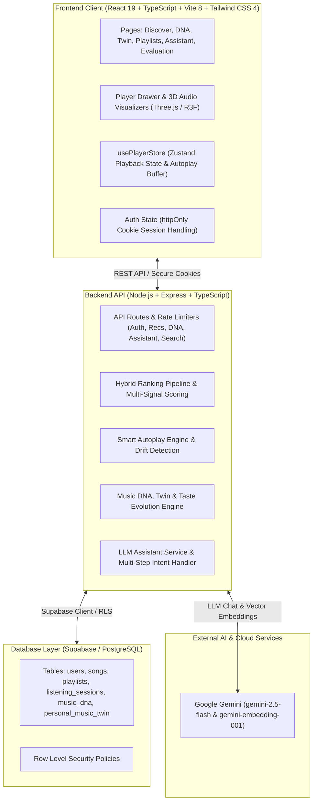

# 🎵 HarmonyAI

> **Intelligent, Context-Aware, Session-Adaptive Music Streaming & Recommendation Platform**

HarmonyAI is an advanced, production-grade music streaming and recommendation platform designed to deliver deeply personalized, situation-aware, and dynamically adaptive audio experiences. Powered by a hybrid multi-signal recommendation engine, ephemeral session taste profiling, Smart Autoplay with dynamic drift detection, Music DNA & Personal Music Twin modeling, Google Gemini LLM assistant integration, and high-performance vector semantic search, HarmonyAI continuously balances user familiarity, musical discovery, and active session vibes in real time without mutating permanent long-term preferences.

The entire backend is powered by **Supabase (PostgreSQL)** with Row Level Security (RLS), role-based access control, httpOnly secure session cookies, and defense-in-depth rate limiting.

---

## 🌟 Key Features

### 1. 🧠 Hybrid Multi-Signal Recommendation Engine
- **Multi-Vector Scoring**: Blends collaborative filtering, content-based acoustic similarity, user taste profile affinity, track popularity, and recency weighting into a unified scoring model.
- **Candidate Generation**: Multi-source pooling featuring cold-start detection, acoustic candidate filtering, and popularity-dampened scoring.
- **Diversity & Novelty Balance**: Prevents repetitive artist clustering (max 2 tracks per artist, no consecutive same-artist tracks) and calibrates discovery-to-familiarity ratios.

### 2. 🎯 Context-Aware Recommendations
- **9 Core Listening Situations**:
  - `study`, `work`, `workout`, `relaxation`, `commute`, `party`, `sleep`, `focus`, and `general_listening`.
- **Acoustic Target Mapping**: Maps situations to acoustic targets (energy, tempo BPM ranges, valence, dominant moods, and novelty).
- **Customizable Overrides**: Allows users to layer custom mood, energy, tempo, and genre preferences while preserving core baseline tastes.

### 3. ⏱️ Real-Time Session Taste Profiling & Drift Detection
- **Ephemeral Session Profiles**: Tracks active user listening interactions (plays, skips, completions, replays, and likes).
- **Signal Weighting**:
  - Amplifies completed ($1.5\times$) and replayed ($2.0\times$) tracks as strong positive signals.
  - Penalizes repeatedly skipped tracks ($-1.2\times$).
  - Applies exponential recency weighting favoring recent session interactions.
- **Strict Isolation**: Ephemeral session profiles never permanently mutate or overwrite the user's permanent long-term preferences.
- **Dynamic Session Drift Detection**: Continuously monitors divergence in genre distribution, artist distribution, energy shift ($\Delta \ge 0.20$), tempo shift ($\Delta \ge 15\text{ BPM}$), and dominant mood to detect real-time listening pivot points.

### 4. ⚡ Smart Autoplay & Adaptive Flow Queue
- **Gapless Continuous Playback**: Automatically populates upcoming tracks when the manual playback queue finishes.
- **Multi-Dimensional Balance**: Harmonizes familiarity (user favorites), discovery (novel tracks aligned with current acoustic targets), and diversity (artist/genre variety).
- **Repetition & Loop Prevention**: Excludes recently played tracks (sliding 20-track history window), current track, and session skips.
- **Selective Regeneration**: Automatically regenerates upcoming autoplay tracks when session taste pivots significantly, avoiding churn during minor micro-events.

### 5. 🧬 Music DNA & Listener Archetype Profiling
- **Acoustic DNA Extraction**: Generates acoustic profiles per user spanning energy, valence, danceability, acousticness, instrumentalness, speechiness, and tempo variance.
- **Musical Personality Profiling**: Computes multi-dimensional musical personality metrics (openness, adventurousness, nostalgia, rhythm affinity).
- **Listener Archetype Engine**: Classifies users into distinct behavioral listener archetypes (e.g., Deep Explorer, Comfort Loyalist, High-Energy Achiever, Eclectic Wandering).

### 6. 👥 Personal Music Twin & Twin Evolution
- **Algorithmic Music Twin**: Creates a synchronized digital twin representing the user's algorithmic musical identity and stylistic boundaries.
- **Twin Evolution Tracking**: Tracks how the twin evolves over time compared to the active listener, highlighting taste maturation and shifting preferences.

### 7. 📈 Taste Evolution Timeline & Boundary Detection
- **Multi-Horizon Temporal Profiling**: Aggregates preferences across short-term (7 days), medium-term (30 days), and long-term (all-time) horizons.
- **Taste Stability & Transformation**: Evaluates taste stability index, drift rates, and transformation velocity.
- **Taste Boundary & Emerging Tastes**: Detects comfort-zone boundaries versus stretch zones, proactively highlighting emerging genre and artist interests.

### 8. 🧭 Outside-Comfort-Zone Discovery & Mode-Based Exploration
- **Personalized Discovery Modes**:
  - `Safe Familiarity`: High-affinity tracks firmly within user comfort zones.
  - `Guided Exploration`: Balanced mix of familiar anchors and adjacent musical discoveries.
  - `Adventurous / Outside Comfort Zone`: Controlled pushes past acoustic boundaries into novel genres, obscure gems, and contrasting moods.
- **Novelty Scoring & Comfort Discovery Balancing**: Quantifies acoustic distance and artist unfamiliarity to prevent jarring recommendation jumps.

### 9. 🤖 Conversational AI Music Assistant
- **Powered by Google Gemini**: Uses `gemini-2.5-flash` with structured tool calling and prompt interpretation.
- **Multi-Step Intent Routing**: Understands natural language requests (e.g., *"give me some low-key chill tracks for late-night coding"*, *"queue up high-energy gym songs"*).
- **Interactive Tool Execution**: Can search the catalog, queue tracks, inspect recommendation explanations, and create custom playlists directly from chat.

### 10. 📝 AI-Powered Playlist Generation & Intelligent Sequencing
- **Prompt Interpretation**: Translates freeform natural language prompts into structured musical concepts (mood, genres, energy targets, tempo ranges, search keywords).
- **Acoustic Curve Sequencing**: Sequences generated playlists with smooth transitions, energy progression curves, and strict artist separation rules.

### 11. 🔍 Semantic Vector Search & Multi-Faceted Discovery
- **Vector Embeddings**: Powered by Google Gemini (`gemini-embedding-001`) embeddings for natural-language semantic music search.
- **Multi-Attribute Search**: Combines keyword search, fuzzy acoustic filtering, and autocomplete search suggestions.
- **Unified Discovery Endpoint**: Orchestrates keyword search, vector similarity, and recommendation seeds in a single query interface.

### 12. 📊 Recommendation Quality Analytics & "Why Not This Song" Explainability
- **Human-Readable Explanations**: Provides transparent reasons for recommendations (*"Recommended because you enjoy Synthwave and recent upbeat tracks"*).
- **"Why Not This Song" Diagnostics**: Diagnostic divergence analysis explaining why specific candidate tracks were ranked lower or filtered out.
- **Feedback Loop**: Tracks user feedback (likes, dismissals) and feeds interaction signals into ranking recalibration.
- **Recommendation Evaluation Dashboard**: Admin tooling for inspecting recommendation precision, recall, diversity, and coverage metrics across strategies.

### 13. 🎛️ Modern Immersive Player & Visualizer UI
- **Full Playback Controls**: Play, pause, seek, volume, mute, shuffle, and repeat modes (`off`, `all`, `one`).
- **Interactive Queue Drawer**: Visual distinction between manual user queue (indigo badges) and Smart Autoplay AI flow (purple badges) with direct skip (`▶`) and dismiss (`✕`) controls.
- **3D Audio Visualizer**: Interactive 3D graphics powered by Three.js and `@react-three/fiber`.
- **Smooth Navigation**: Lenis smooth scrolling, Media Chrome audio player components, and responsive modern layouts.

### 14. 🔒 Enterprise Security & Database Architecture
- **Supabase (PostgreSQL)**: Clean relational schema with Row Level Security (RLS) policies enforcing strict user-data isolation.
- **httpOnly Secure Cookies**: JWT session tokens stored in `httpOnly`, `SameSite=Lax` cookies (with `Secure` in production) to mitigate XSS risks.
- **HTTPS Enforcement**: Automatic HTTP-to-HTTPS redirect in production environments via proxy-aware `x-forwarded-proto`.
- **Defense-in-Depth Rate Limiting**: Tiered express rate-limiters with IPv6-safe key generators across authentication, general API routes, and per-user LLM endpoints.
- **PostgREST Injection Protection**: Strict input sanitization and character escaping for all Supabase filter queries.
- **Pre-Commit Secret Scanning**: Dedicated `.githooks` pre-commit hook preventing credential leakage.

---

## 🏗️ Architecture & Technology Stack



### Technology Highlights

| Layer | Technologies |
| :--- | :--- |
| **Frontend Framework** | React 19, TypeScript, Vite 8 |
| **Styling & Animation** | Tailwind CSS 4, Framer Motion, Lenis Smooth Scroll |
| **State Management** | Zustand 5 |
| **3D & Media** | Three.js, `@react-three/fiber`, `@react-three/drei`, Media Chrome |
| **Icons & UI** | Lucide React, Phosphor Icons, `@base-ui/react` |
| **Testing & Quality** | Playwright (E2E), Oxlint |
| **Backend Runtime** | Node.js, Express 4, TypeScript (`tsx` / `tsc`) |
| **Database & Auth** | Supabase (PostgreSQL), `@supabase/supabase-js`, Row Level Security |
| **Security & Auth** | JWT, bcryptjs, cookie-parser, helmet, express-rate-limit |
| **AI & Embeddings** | Google Gemini SDK (`gemini-2.5-flash`, `gemini-embedding-001`) |
| **Backend Testing** | 117+ test suites covering algorithmic models, ranking, session adaptation, DNA, and security |

---

## 📂 Project Structure

```text
HarmonyAI/
├── .githooks/                  # Pre-commit secret scanning hooks
├── backend/
│   ├── src/
│   │   ├── config/             # Supabase client, recommendation weights & drift thresholds
│   │   ├── controllers/        # Controllers (auth, recommendations, assistant, DNA, playlists, search)
│   │   ├── middlewares/        # Auth (protect, requireAdmin), rate limiters, error handling
│   │   ├── routes/             # Express API route declarations
│   │   │   ├── adminRecommendationRoutes.ts
│   │   │   ├── assistantRoutes.ts
│   │   │   ├── authRoutes.ts
│   │   │   ├── musicDnaRoutes / recommendationRoutes.ts
│   │   │   ├── playlistRoutes.ts
│   │   │   ├── searchRoutes.ts
│   │   │   ├── songRoutes.ts
│   │   │   └── userRoutes.ts
│   │   ├── services/           # 90+ algorithmic engines & services:
│   │   │   ├── hybridRankingPipeline.ts           # Multi-signal hybrid recommendation engine
│   │   │   ├── smartAutoplayService.ts            # Continuous flow adaptive queue & drift evaluation
│   │   │   ├── sessionTasteProfileService.ts      # Ephemeral session taste profiling
│   │   │   ├── musicDnaProfilingService.ts        # Acoustic DNA & personality extraction
│   │   │   ├── personalMusicTwinService.ts        # Algorithmic personal music twin
│   │   │   ├── tasteEvolutionDiscoveryService.ts  # Multi-horizon taste drift & boundary detection
│   │   │   ├── outsideComfortZoneRecommendationService.ts # Controlled novelty exploration
│   │   │   ├── aiPlaylistGenerationService.ts     # Natural language playlist generation
│   │   │   ├── assistantIntentService.ts          # Gemini LLM intent classification & tool calling
│   │   │   ├── semanticSearchService.ts           # Vector embedding search
│   │   │   └── recommendationExplanationService.ts# Explainability & "Why Not This Song"
│   │   ├── types/
│   │   │   └── domainModels.ts                    # Plain TypeScript domain interfaces (ISong, IUser, etc.)
│   │   └── __tests__/          # 117+ unit & integration test suites
│   ├── package.json
│   ├── tsconfig.json
│   └── .env.example
├── frontend/
│   ├── src/
│   │   ├── components/         # MiniPlayer, QueueDrawer, 3D Visualizer, ContextSelector, Navbar
│   │   ├── hooks/              # usePlayer, useAuth, useAudio
│   │   ├── lib/                # Supabase client setup
│   │   ├── pages/              # 23 pages (Home, Discover, DNA, Twin, Evolution, Assistant, Search, etc.)
│   │   ├── services/           # Frontend API clients (recommendations, assistant, sessions, search)
│   │   ├── store/              # usePlayerStore (Zustand music player & autoplay queue)
│   │   ├── types/              # Frontend TypeScript interfaces
│   │   ├── App.tsx             # Main routing & application shell
│   │   └── main.tsx            # React bootstrap with font imports
│   ├── package.json
│   ├── vite.config.ts
│   ├── tsconfig.json
│   └── .env.example
├── package.json                # Monorepo root scripts (dev, build)
└── README.md
```

---

## 🚀 Getting Started

### Prerequisites
- **Node.js** (v18+ or v20+ recommended)
- **npm** (v9+)
- **Supabase Project** (PostgreSQL database + API URL & anon key)
- **Google Gemini API Key** *(Optional)*: Required for Gemini LLM Assistant, AI Playlist Generation, and Semantic Vector Search. If omitted, the system falls back to rule-based algorithms.

### 1. Clone & Set Up Git Hooks
```bash
git clone https://github.com/Skan0710/HarmonyAI.git
cd HarmonyAI

# Enable the pre-commit secret scanning hook
git config core.hooksPath .githooks
```

### 2. Environment Configuration

#### Backend Configuration (`backend/.env`):
Create `backend/.env` (see `backend/.env.example`):
```env
PORT=5000
NODE_ENV=development
JWT_SECRET=your_super_secret_jwt_key_here
JWT_EXPIRES_IN=7d

# CORS: Comma-separated allowed origins (no trailing slash)
CORS_ORIGIN=http://localhost:3000,http://localhost:5173

# Supabase Database Configuration
SUPABASE_URL=https://your-project.supabase.co
SUPABASE_ANON_KEY=your_supabase_anon_key_here

# Google Gemini LLM & Embeddings (Optional)
GEMINI_API_KEY=your_gemini_api_key_here
LLM_MODEL=gemini-2.5-flash
EMBEDDING_MODEL=gemini-embedding-001
```

#### Frontend Configuration (`frontend/.env`):
Create `frontend/.env` (see `frontend/.env.example`):
```env
VITE_API_BASE_URL=http://localhost:5000/api
VITE_SUPABASE_URL=https://your-project.supabase.co
VITE_SUPABASE_ANON_KEY=your_supabase_anon_key_here
```

### 3. Install Dependencies
```bash
# Install root dependencies
npm install

# Install backend dependencies
cd backend && npm install

# Install frontend dependencies
cd ../frontend && npm install
cd ..
```

### 4. Database Setup & Seeding (Optional)
Populate the Supabase database with sample genres, artists, albums, and tracks:
```bash
cd backend
npm run seed
cd ..
```

### 5. Run the Application
Run both backend and frontend concurrently from the root directory:
```bash
npm run dev
```

Or run each service individually:
```bash
# Terminal 1: Backend API (http://localhost:5000)
npm run dev:backend

# Terminal 2: Frontend Client (http://localhost:5173)
npm run dev:frontend
```

---

## 🧪 Testing & Quality Assurance

### Backend Type Checking & Compilation
The backend TypeScript code compiles cleanly with strict type safety:
```bash
cd backend
npx tsc --noEmit
# or build for production
npm run build
```

### Frontend Type Checking, Linting & E2E Testing
```bash
cd frontend

# Run Oxlint linter
npm run lint

# Build frontend production bundle
npm run build

# Run Playwright End-to-End tests
npm run test:e2e

# Run Playwright E2E tests with UI runner
npm run test:e2e:ui
```

---

## 📡 API Reference Overview

### Authentication & User Management
| Method | Endpoint | Access | Description |
| :--- | :--- | :--- | :--- |
| `POST` | `/api/auth/register` | Public | Register new user account |
| `POST` | `/api/auth/login` | Public | Authenticate user & issue httpOnly session cookie |
| `POST` | `/api/auth/logout` | Public | Clear httpOnly session cookie server-side |
| `GET` | `/api/auth/me` | Protected | Get current authenticated user profile |
| `PUT` | `/api/users/me` | Protected | Update user profile and listening preferences |
| `GET` | `/api/users/me/listening-profile` | Protected | Fetch user listening profile and stats |
| `GET` | `/api/users/liked-songs` | Protected | Retrieve user liked songs |
| `POST` | `/api/users/liked-songs/:songId` | Protected | Like a song |
| `DELETE` | `/api/users/liked-songs/:songId` | Protected | Unlike a song |

### Recommendations & Smart Autoplay
| Method | Endpoint | Access | Description |
| :--- | :--- | :--- | :--- |
| `GET` | `/api/recommendations/hybrid` | Protected | Multi-signal hybrid recommendations |
| `GET` | `/api/recommendations/context` | Protected | Context-aware recommendations for 9 listening situations |
| `GET` | `/api/recommendations/session` | Protected | Recommendations biased by active ephemeral session taste |
| `GET` / `POST` | `/api/recommendations/autoplay` | Protected | Smart Autoplay adaptive continuous-flow queue |
| `GET` | `/api/recommendations/modes` | Protected | List available discovery exploration modes |
| `GET` | `/api/recommendations/modes/:mode` | Protected | Recommendations tailored to a specific discovery mode |
| `GET` | `/api/recommendations/similar/:songId` | Public | Content-based acoustically similar songs |
| `GET` | `/api/recommendations/collaborative` | Protected | User-user collaborative filtering recommendations |
| `GET` | `/api/recommendations/explain/:songId` | Protected | Transparent reasoning for why a song was recommended |
| `POST` | `/api/recommendations/feedback` | Protected | Submit user feedback on recommendations |
| `POST` | `/api/recommendations/interactions` | Protected | Track song plays, skips, completions, and replays |

### Music DNA & Personal Music Twin
| Method | Endpoint | Access | Description |
| :--- | :--- | :--- | :--- |
| `GET` | `/api/recommendations/music-dna` | Protected | Retrieve acoustic DNA & musical personality profile |
| `POST` | `/api/recommendations/music-dna/refresh` | Protected | Trigger recalculation of Music DNA profile |
| `GET` | `/api/recommendations/personal-music-twin` | Protected | Get Personal Music Twin status and trajectory |
| `POST` | `/api/recommendations/personal-music-twin/refresh` | Protected | Refresh Personal Music Twin model |
| `GET` | `/api/recommendations/music-dna/evolution` | Protected | Taste evolution overview, drift rates, and stability |
| `GET` | `/api/recommendations/music-dna/evolution/timeline` | Protected | Multi-horizon temporal preference timeline |
| `GET` | `/api/recommendations/music-dna/evolution/emerging` | Protected | Emerging genre and artist tastes |
| `GET` | `/api/recommendations/music-dna/snapshots` | Protected | View saved Music DNA historical snapshots |
| `POST` | `/api/recommendations/music-dna/snapshots` | Protected | Create snapshot of current musical taste profile |

### Conversational AI Assistant & Playlists
| Method | Endpoint | Access | Description |
| :--- | :--- | :--- | :--- |
| `POST` | `/api/assistant/chat` | Protected | Conversational music assistant powered by Gemini |
| `POST` | `/api/recommendations/assistant` | Protected | Contextual music recommendations via natural language |
| `POST` | `/api/playlists/ai-generate` | Protected | Generate structured playlist from natural language prompt |
| `GET` | `/api/playlists` | Protected | Retrieve current user playlists |
| `POST` | `/api/playlists` | Protected | Create new custom playlist |
| `GET` | `/api/playlists/:id` | Optional | Retrieve playlist by ID |
| `POST` | `/api/playlists/:id/songs` | Protected | Add song to playlist |
| `DELETE` | `/api/playlists/:id/songs/:songId` | Protected | Remove song from playlist |

### Search & Discovery
| Method | Endpoint | Access | Description |
| :--- | :--- | :--- | :--- |
| `GET` | `/api/search` | Public | Fast keyword catalog search (songs, artists, albums) |
| `GET` | `/api/search/suggestions` | Public | Autocomplete search suggestions with prefix matching |
| `GET` | `/api/search/semantic` | Protected | Semantic vector search powered by Gemini embeddings |
| `GET` | `/api/search/discover` | Optional | Unified discovery endpoint blending keyword & semantic modes |

### Listening History & Admin Diagnostics
| Method | Endpoint | Access | Description |
| :--- | :--- | :--- | :--- |
| `POST` | `/api/history/record/:songId` | Protected | Record playback event to user history |
| `GET` | `/api/history` | Protected | Get paginated user listening history |
| `GET` | `/api/history/recently-played` | Protected | Get recently played tracks |
| `GET` | `/api/recommendations/performance` | Protected | Recommendation quality & engagement metrics |
| `GET` | `/api/admin/recommendations/evaluate` | Admin | Run recommendation offline evaluation across strategies |

---

## 🔒 Security & Defense-in-Depth

- **Token Protection**: JWTs are stored inside `httpOnly`, `SameSite=Lax` cookies, neutralizing malicious scripts from accessing authentication tokens.
- **Strict HTTPS**: Enforces HTTPS redirection in production environments via proxy-aware `x-forwarded-proto` headers.
- **Row-Level Security (RLS)**: Database tables enforce PostgreSQL RLS policies to safeguard multi-tenant data boundaries.
- **Granular Rate Limiting**: Dedicated rate limits for login attempts, registration, admin evaluation, and LLM queries with IPv6-safe subnet key generation.
- **Admin Authorization**: Catalog mutation endpoints (`POST /api/songs`, `PUT /api/songs/:id`, `DELETE /api/songs/:id`) and diagnostic evaluation suites are restricted to users with the `admin` role.
- **Input Sanitization**: PostgREST filter injection protection escapes special characters in query parameters.
- **Pre-Commit Secrets Scanning**: Automated pre-commit hooks prevent credentials and private keys from entering version control.

---

## 📄 License

This project is licensed under the MIT License. See [LICENSE](LICENSE) for details.
