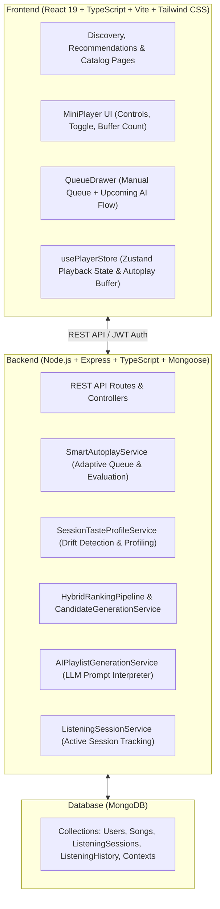

# 🎵 HarmonyAI

> **Intelligent, Context-Aware, Session-Adaptive Music Streaming & Recommendation Platform**

HarmonyAI is an advanced music streaming and recommendation platform designed to deliver personalized, situation-aware, and dynamically adaptive audio experiences. Powered by a hybrid multi-signal recommendation engine, temporary session taste profiling, and Smart Autoplay, HarmonyAI continuously balances user favorites, musical discovery, and session vibes in real time without overwriting long-term preferences.

---

## 🌟 Key Features

### 1. 🧠 Hybrid Multi-Signal Recommendation Engine
- **Multi-Vector Scoring**: Combines content-based similarity, collaborative filtering, user taste profile affinity, track popularity, and recency weighting.
- **Candidate Generation**: Multi-source candidate pooling with cold-start detection and novelty balancing.
- **Diversity & Novelty Filtering**: Prevents repetitive artist clustering (maximum 2 tracks per artist, no consecutive same-artist tracks) and balances discovery ratios.

### 2. 🎯 Context-Aware Recommendations
- **9 Core Listening Situations**:
  - `study`, `work`, `workout`, `relaxation`, `commute`, `party`, `sleep`, `focus`, and `general_listening`.
- **Acoustic Target Mapping**: Maps situations to acoustic targets (energy, tempo BPM ranges, dominant moods, and novelty).
- **Customizable Preferences**: Users can layer custom mood, energy, tempo, and genre overrides while preserving core taste baselines.

### 3. ⏱️ Real-Time Session Taste Profiling
- **Temporary Ephemeral Profiles**: Tracks active user listening sessions (plays, skips, completions, replays, and likes).
- **Signal Weighting**:
  - Amplifies completed ($1.5\times$) and replayed ($2.0\times$) tracks as strong positive signals.
  - Penalizes repeatedly skipped tracks ($-1.2\times$).
  - Exponential recency weighting prioritizing latest session interactions.
- **Strict Isolation**: Ephemeral session profiles never permanently mutate or overwrite the user's permanent long-term preferences.

### 4. ⚡ Smart Autoplay & Adaptive Queue
- **Gapless Continuous Flow**: Automatically populates upcoming tracks when the manual playback queue finishes.
- **Multi-Dimensional Balance**:
  - **Familiarity**: Established user favorites and taste-affinity tracks.
  - **Discovery**: Novel recommendations aligned with active acoustic targets.
  - **Diversity**: Artist and genre variety without duplicate tracks.
- **Repetition & Loop Prevention**: Excludes recently played tracks (sliding 20-track history window), current track, and session skips.
- **Queue Size & Clamping**: Fully configurable queue size (1 to 30 tracks).

### 5. 🔄 Dynamic Session Autoplay Adaptation
- **Multidimensional Drift Detection**: Continuously evaluates divergence across:
  - Genre distribution
  - Artist distribution
  - Energy shift ($\Delta \ge 0.20$)
  - Tempo / BPM shift ($\Delta \ge 15\text{ BPM}$)
  - Dominant mood divergence
  - Consecutive skips ($\ge 2$)
- **Selective Regeneration**: Automatically regenerates upcoming autoplay tracks when session taste pivots significantly, while avoiding regeneration churn during minor micro-events.

### 6. 🎛️ HarmonyAI Player & Interactive Queue Drawer
- **Player Controls**: Play, pause, skip, seek, volume, mute, shuffle, and repeat modes (`off`, `all`, `one`).
- **Smart Autoplay Visibility**:
  - Glowing toggle switch with active status indicators and buffered upcoming track counter.
  - Animated loading states and non-disruptive error recovery with retry mechanisms.
- **Queue Drawer Visual Distinction**:
  - **Active Manual Queue**: Highlighted with indigo accents, track order, and `Manual Priority` badges.
  - **Upcoming Smart Autoplay Queue**: Highlighted with purple accents, `AI Flow` chips, and individual controls to skip directly (`▶`) or dismiss (`✕`) specific AI recommendations.
  - **Manual Queue Absolute Priority**: User-queued tracks always play before any autoplay songs.

### 7. 🤖 AI-Powered Playlist Generation & Sequencing
- **Prompt Interpretation**: Translates natural language prompts (e.g., *"upbeat 80s synthwave workout mix for the gym"*) into structured musical concepts (mood, genres, energy level, tempo targets, and search keywords).
- **Intelligent Sequencing**: Orders generated playlists with smooth acoustic transitions, gradual energy progression, and artist separation.

### 8. 🔍 Recommendation Explainability & Feedback
- **Transparent Reasoning**: Generates human-readable explanations (*"Recommended because you enjoy Synthwave and recent upbeat tracks"*).
- **"Why Not This Song" Analysis**: Diagnostic divergence inspection comparing unchosen tracks against active recommendation weights.
- **User Feedback Loop**: Captures explicit recommendation feedback to refine future ranking decisions.

---

## 🏗️ Architecture & Technology Stack



### Technology Highlights
- **Frontend**:
  - React 19 & TypeScript
  - Vite 8 (Hot Module Replacement & production bundling)
  - Tailwind CSS 4
  - Zustand 5 (Reactive client state management)
  - React Router DOM 7
- **Backend**:
  - Node.js & Express 4
  - TypeScript (Strict type safety)
  - Mongoose 9 & MongoDB
  - JSON Web Tokens (JWT) & bcryptjs
  - tsx & nodemon development environment
- **Testing**:
  - Comprehensive unit and integration test suites (over 42 suites, 274+ automated tests)

---

## 📂 Project Structure

```text
HarmonyAI/
├── backend/
│   ├── src/
│   │   ├── config/             # Recommendation weights, recency, session & drift configs
│   │   ├── controllers/        # Auth, song, recommendation, playlist & session controllers
│   │   ├── middleware/         # Auth, validation, and error middleware
│   │   ├── models/             # Mongoose schemas (Song, User, ListeningSession, History, etc.)
│   │   ├── routes/             # Express API route declarations
│   │   ├── schemas/            # Validation schemas (Context, AI playlist preference)
│   │   ├── services/           # Core algorithmic engines:
│   │   │   ├── smartAutoplayService.ts            # Adaptive autoplay queue generation & evaluation
│   │   │   ├── sessionTasteProfileService.ts      # Ephemeral session profiling & drift detection
│   │   │   ├── hybridRankingPipeline.ts           # Multi-signal hybrid ranking pipeline
│   │   │   ├── candidateGenerationService.ts      # Candidate generation & filtering
│   │   │   ├── contextPreferenceMappingService.ts # Acoustic context mapping & normalization
│   │   │   ├── aiPlaylistGenerationService.ts     # Natural language playlist generation
│   │   │   ├── recommendationExplanationService.ts# Multi-signal explainability engine
│   │   │   └── listeningSessionService.ts         # User session lifecycle & event recording
│   │   └── __tests__/          # 42+ automated backend test suites (100% pass rate)
│   ├── package.json
│   └── tsconfig.json
├── frontend/
│   ├── src/
│   │   ├── components/         # MiniPlayer, QueueDrawer, ContextSelector, Navbar, etc.
│   │   ├── hooks/              # usePlayer, useAuth, custom hooks
│   │   ├── pages/              # Discovery, Recommendations, Playlists, Catalog, Profile
│   │   ├── services/           # Frontend API clients (recommendations, sessions, songs)
│   │   ├── store/              # usePlayerStore (Zustand music player & autoplay queue)
│   │   ├── types/              # Frontend TypeScript interfaces
│   │   ├── App.tsx             # Main routing and layout
│   │   └── main.tsx            # App bootstrap
│   ├── package.json
│   ├── vite.config.ts
│   └── tsconfig.json
├── package.json                # Monorepo root scripts
└── README.md
```

---

## 🚀 Getting Started

### Prerequisites
- **Node.js** (v18+ or v20+ recommended)
- **npm** (v9+)
- **MongoDB** (Local instance or MongoDB Atlas URI)

### 1. Clone the Repository
```bash
git clone https://github.com/Skan0710/HarmonyAI.git
cd HarmonyAI
```

### 2. Environment Configuration

#### Backend Configuration (`backend/.env`):
```env
PORT=5000
MONGODB_URI=mongodb://localhost:27017/harmonyai
JWT_SECRET=your_super_secret_jwt_key_here
NODE_ENV=development
FRONTEND_URL=http://localhost:5173
```

#### Frontend Configuration (`frontend/.env`):
```env
VITE_API_URL=http://localhost:5000/api
```

### 3. Install Dependencies
```bash
# Install root, backend, and frontend dependencies
npm install
cd backend && npm install
cd ../frontend && npm install
cd ..
```

### 4. Seed Sample Catalog (Optional)
```bash
cd backend
npm run seed
cd ..
```

### 5. Run the Application
You can run both backend and frontend concurrently from the root directory:
```bash
npm run dev
```

Or run services individually in separate terminals:
```bash
# Terminal 1: Backend API (http://localhost:5000)
npm run dev:backend

# Terminal 2: Frontend Client (http://localhost:5173)
npm run dev:frontend
```

---

## 🧪 Testing & Verification

HarmonyAI includes extensive unit and integration tests covering algorithmic ranking, context mapping, session taste adaptation, player logic, and API endpoints.

### Run Backend Test Suites
```bash
# Build backend TypeScript
cd backend
npm run build

# Run the complete test suite runner (42 test suites, 274+ tests)
node -e "
async function runAllSuites() {
  const suites = [
    './dist/__tests__/smartAutoplayComprehensiveRefinement.test.js',
    './dist/__tests__/dynamicSessionAutoplayAdaptation.test.js',
    './dist/__tests__/playerSmartAutoplayLogic.test.js',
    './dist/__tests__/smartAutoplayEndpoint.test.js',
    './dist/__tests__/smartAutoplayAdaptiveQueue.test.js',
    './dist/__tests__/smartAutoplayService.test.js',
    './dist/__tests__/smartAutoplayEngine.test.js',
    './dist/__tests__/listeningSessionRecommendationIntegration.test.js',
    './dist/__tests__/sessionTasteProfileService.test.js',
    './dist/__tests__/listeningSessionModel.test.js',
    './dist/__tests__/listeningSessionService.test.js',
    './dist/__tests__/recommendationContextModel.test.js',
    './dist/__tests__/contextPreferenceMappingService.test.js',
    './dist/__tests__/recommendationContextIntegration.test.js',
    './dist/__tests__/contextAwareRecommendationEndpoint.test.js',
    './dist/__tests__/contextualRecommendationEndToEnd.test.js',
    './dist/__tests__/recommendationExplainabilityComprehensive.test.js'
  ];
  for (const s of suites) {
    const mod = await import(s);
    const fn = Object.values(mod).find(v => typeof v === 'function');
    if (fn) await fn();
  }
  console.log('🎉 ALL TEST SUITES EXECUTED AND PASSED WITH 100% SUCCESS!');
}
runAllSuites();
"
```

### Validate Frontend Production Build
```bash
cd frontend
npm run build
```

---

## 📡 API Overview (Selected Endpoints)

| Method | Endpoint | Description |
| :--- | :--- | :--- |
| `POST` | `/api/auth/register` | Register new user account |
| `POST` | `/api/auth/login` | Authenticate user & return JWT |
| `GET` | `/api/recommendations` | Personalized hybrid recommendations |
| `GET` | `/api/recommendations/context` | Context-aware recommendations (study, workout, etc.) |
| `GET` | `/api/recommendations/session` | Recommendations biased by active session taste profile |
| `GET` / `POST` | `/api/recommendations/autoplay` | Smart Autoplay adaptive queue endpoint |
| `POST` | `/api/playlists/ai-generate` | Generate AI playlist from natural language prompt |
| `POST` | `/api/sessions/start` | Start new listening session |
| `POST` | `/api/sessions/event` | Record play, skip, completion, or replay event |
| `POST` | `/api/sessions/end` | End active listening session |
| `GET` | `/api/recommendations/explain/:songId` | Explain why a song was recommended |
| `POST` | `/api/recommendations/feedback` | Record recommendation like/dislike feedback |

---

## 📄 License

This project is licensed under the MIT License. See [LICENSE](LICENSE) for details.
